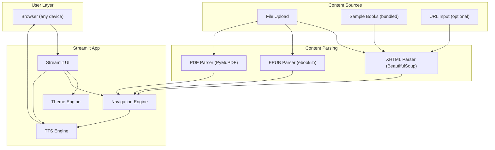

# Accessible Ebook Reader for Visually Impaired Students

## Project Overview

A free, web-based accessible ebook reader built with Python/Streamlit that enables visually impaired students to consume XHTML/EPUB textbook content through text-to-speech, keyboard navigation, and high-contrast UI. Deployed at zero cost on Streamlit Community Cloud or HuggingFace Spaces.

---

## Problem Statement

Visually impaired students lack affordable, purpose-built tools to consume digital textbook content (XHTML/EPUB). Generic screen readers (NVDA, JAWS) are either desktop-only, expensive, or not optimized for structured educational content. This project provides a free, browser-based, always-available reading experience tailored for ebooks.

---

## Target Users

- **Primary**: Visually impaired students consuming textbooks
- **Secondary**: Low-vision students, students with dyslexia, educators testing content accessibility

---

## Tech Stack

| Layer | Technology | Why |
|-------|-----------|-----|
| UI Framework | Streamlit (Python) | Rapid development, free hosting, built-in widgets |
| TTS Engine | gTTS (Google Text-to-Speech) | Free, high-quality, multi-language |
| TTS Fallback | pyttsx3 | Offline-capable, no API dependency |
| Content Parsing | BeautifulSoup4 | Parse XHTML structure (headings, paragraphs, lists, tables) |
| EPUB Support | ebooklib | Parse .epub files into chapters/XHTML |
| PDF Support | PyMuPDF (fitz) | Extract text from PDFs |
| Audio Playback | streamlit-audio (or base64 autoplay) | Play TTS audio in browser |
| Hosting | Streamlit Community Cloud / HuggingFace Spaces | Free, zero-config deployment |
| Version Control | GitHub (new account/repo) | Required for Streamlit Cloud deploy |

---

## Architecture



---

## Project Structure

```
accessible-reader/
├── app.py                      # Main Streamlit entry point
├── pages/
│   ├── 1_Reader.py             # Core reading experience
│   ├── 2_Library.py            # Browse/upload books
│   └── 3_Settings.py           # Accessibility preferences
├── utils/
│   ├── parser.py               # XHTML/EPUB/PDF content parser
│   ├── tts_engine.py           # Text-to-speech (gTTS + pyttsx3)
│   ├── navigator.py            # Content navigation (chapter/heading/para/sentence)
│   ├── theme.py                # High-contrast themes, font sizing
│   └── accessibility.py        # ARIA helpers, keyboard shortcut JS injection
├── assets/
│   ├── sample_books/           # 2-3 sample XHTML/EPUB files for demo
│   ├── fonts/                  # OpenDyslexic font files
│   └── css/                    # Custom CSS for themes
├── config/
│   └── settings.py             # App constants, default preferences
├── tests/
│   ├── test_parser.py          # Unit tests for content parser
│   ├── test_tts.py             # Unit tests for TTS engine
│   └── test_navigator.py       # Unit tests for navigation logic
├── .streamlit/
│   └── config.toml             # Streamlit theme config
├── requirements.txt            # Python dependencies with pinned versions
├── README.md                   # Project overview, setup, deploy instructions
├── LICENSE                     # MIT License
└── .gitignore                  # Standard Python .gitignore
```

---

## Feature Breakdown (Phased)

### Phase 1 — Core MVP (Week 1-2)

| Feature | Description | Priority |
|---------|------------|----------|
| File upload | Upload XHTML, EPUB, or PDF files | P0 |
| Content parsing | Extract structured text (headings, paragraphs, lists) from uploads | P0 |
| Chapter navigation | Sidebar with chapter list, click to jump | P0 |
| TTS playback | Play/Pause/Stop buttons, reads current section aloud | P0 |
| Speed control | Slider: 0.5x to 2.0x speech speed | P0 |
| High-contrast theme | Dark, Light, Yellow-on-Black modes | P0 |
| Font size control | Slider: 12px to 36px | P0 |
| Sample books | 2-3 bundled sample books for instant demo | P0 |
| Deploy to Streamlit Cloud | Free hosting, accessible via URL | P0 |

### Phase 2 — Enhanced Navigation (Week 3-4)

| Feature | Description | Priority |
|---------|------------|----------|
| Heading navigation | Jump between headings within a chapter | P1 |
| Paragraph-by-paragraph reading | Read one paragraph at a time with Next/Previous | P1 |
| Text highlighting | Highlight the sentence currently being read | P1 |
| Bookmarks | Save and resume reading position (session state) | P1 |
| Keyboard shortcuts | Spacebar=play/pause, arrows=navigate, H=next heading | P1 |
| Reading progress bar | Visual indicator of position in chapter/book | P1 |
| OpenDyslexic font | Toggle dyslexia-friendly font | P1 |

### Phase 3 — Advanced Features (Week 5-6)

| Feature | Description | Priority |
|---------|------------|----------|
| Multi-language TTS | Support Hindi, Marathi, and other Indian languages | P2 |
| Voice selection | Choose from available TTS voices | P2 |
| Word-by-word mode | Highlight and read one word at a time (for learning) | P2 |
| Table reading | Intelligent reading of table content (row-by-row, cell announcements) | P2 |
| Image alt-text reading | Read alt-text for images in content | P2 |
| Export audio | Download chapter as MP3 for offline listening | P2 |
| User preferences persistence | Save settings across sessions (via URL params or cookies) | P2 |

---

## Key Implementation Details

### 1. Content Parser (`utils/parser.py`)

The parser should handle three input formats and produce a unified content model:

```python
@dataclass
class ContentNode:
    type: str          # "heading", "paragraph", "list", "table", "image"
    level: int         # heading level (1-6), 0 for non-headings
    text: str          # plain text content
    html: str          # original HTML for display
    children: list     # nested nodes (for lists, tables)

@dataclass
class Chapter:
    title: str
    nodes: list[ContentNode]

@dataclass
class Book:
    title: str
    chapters: list[Chapter]
```

- XHTML: Use BeautifulSoup to walk the DOM tree, extract semantic elements
- EPUB: Use ebooklib to extract spine items, then parse each as XHTML
- PDF: Use PyMuPDF to extract text blocks with position info, group into paragraphs

### 2. TTS Engine (`utils/tts_engine.py`)

- Primary: gTTS (Google Text-to-Speech) — generates MP3 audio from text
- Playback: Encode MP3 as base64, inject into Streamlit via `st.audio()` or HTML `<audio autoplay>`
- Speed control: gTTS `slow` parameter + post-processing with pydub for fine-grained speed
- Chunking: Split text into sentence-level chunks for responsive playback and highlighting sync

### 3. Theme Engine (`utils/theme.py`)

Four built-in themes:

- **Default Light**: White background, dark text
- **Dark Mode**: Dark background (#1a1a2e), light text (#eee)
- **High Contrast**: Black background, bright white/yellow text
- **Sepia**: Warm background (#f4ecd8), dark brown text — reduces eye strain

Inject custom CSS via `st.markdown()` with `unsafe_allow_html=True`.

### 4. Keyboard Shortcuts (`utils/accessibility.py`)

Inject JavaScript into Streamlit for keyboard handling:

- `Space` — Play / Pause TTS
- `Escape` — Stop TTS
- `Right Arrow` — Next paragraph/section
- `Left Arrow` — Previous paragraph/section
- `H` — Jump to next heading
- `Shift+H` — Jump to previous heading
- `+` / `-` — Increase / decrease font size
- `T` — Cycle through themes
- `1-9` — Jump to chapter by number

---

## Dependencies (`requirements.txt`)

```
streamlit>=1.35.0
beautifulsoup4>=4.12.0
ebooklib>=0.18
gTTS>=2.5.0
pydub>=0.25.1
PyMuPDF>=1.24.0
lxml>=5.0.0
```

---

## Deployment

### Option A: Streamlit Community Cloud (Recommended)

1. Push code to a public GitHub repository
2. Go to https://share.streamlit.io
3. Sign in with GitHub
4. Select repo, branch, and `app.py` as entry point
5. Click Deploy
6. App is live at `https://your-app.streamlit.app`

### Option B: HuggingFace Spaces

1. Create a new Space on https://huggingface.co/spaces
2. Select "Streamlit" as the SDK
3. Push code to the HuggingFace repo (or link GitHub repo)
4. App auto-deploys at `https://huggingface.co/spaces/your-name/accessible-reader`

### Option C: Local Development

```bash
# Clone the repo
git clone https://github.com/your-username/accessible-reader.git
cd accessible-reader

# Create virtual environment
python -m venv venv
source venv/bin/activate  # Linux/Mac
# or: venv\Scripts\activate  # Windows

# Install dependencies
pip install -r requirements.txt

# Run the app
streamlit run app.py
```

---

## Accessibility Standards (WCAG 2.1 AA)

The app itself must be accessible:

- All controls keyboard-reachable (no mouse-only interactions)
- Minimum 4.5:1 color contrast ratio in all themes
- Focus indicators visible on all interactive elements
- Skip-to-content mechanism
- All images have alt text
- No content conveyed only through color
- Error messages announced clearly
- Responsive layout (mobile-friendly)

---

## Testing Strategy

- **Unit tests**: Parser, TTS engine, navigator logic (pytest)
- **Manual accessibility testing**: NVDA/VoiceOver with the deployed app
- **Cross-browser testing**: Chrome, Firefox, Safari, Edge
- **Mobile testing**: iOS Safari, Android Chrome
- **User testing**: With actual visually impaired users (critical before public launch)

---

## Sample XHTML Content Structure (from Kitaboo pipeline)

The existing Kitaboo processor generates XHTML files named `op2_page_{pageId}.xhtml`. The parser should handle this naming convention and extract content from the semantic HTML structure (headings, paragraphs, tables, images with alt text).

---

## Success Criteria

- A visually impaired student can upload an EPUB/XHTML file and have it read aloud
- Navigation by chapter and heading works via keyboard only
- The app loads and works on mobile browsers
- Deployed and accessible via a public URL at zero cost
- Meets WCAG 2.1 AA compliance for its own UI

---

## Future Enhancements (Post-MVP)

- Integration with Kitaboo backend API (fetch books directly)
- AI-powered content summarization per chapter
- Quiz/comprehension check mode (read question, accept voice answer)
- Collaborative notes (teacher annotates, student hears annotations)
- Migrate to full Angular + Spring Boot stack on Oracle Cloud free tier for production scale
